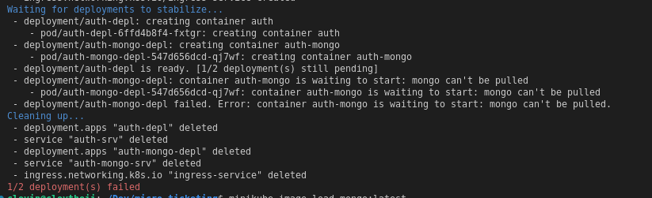

## local run
<ul>
<li>start minikube `minikube start` 
<li>check if ingress is running `kubectl get pods --namespace=ingress-nginx` 
<li>enable ingress on minikube `minikube addons enable ingress`
<li>run skaffold `skaffold dev`
</ul>
<b>Ref:</b>

### problems with nginx
[trouble shooting](https://stackoverflow.com/questions/65182580/kubernetes-ingress-controller-error-imagepullbackoff)
### ingress documentation
[doc](https://kubernetes.github.io/ingress-nginx/deploy/#minikube)

## trouble shooting
Unable to pull images in minikube, pre-load the image using `minikube image load <image name>:<tag>` 
 
  
<b>Note:</b> you first have to pull the image from docker to your local machine
 <b>Ref:</b> [StackOverflow](https://stackoverflow.com/questions/42564058/how-to-use-local-docker-images-with-minikube) 

## helpful commands
Clear Chrome DNS to help access domains set on /etc/hosts `chrome://net-internals/#sockets`
 
delete validation if ingress config fails `kubectl delete -A ValidatingWebhookConfiguration ingress-nginx-admission`